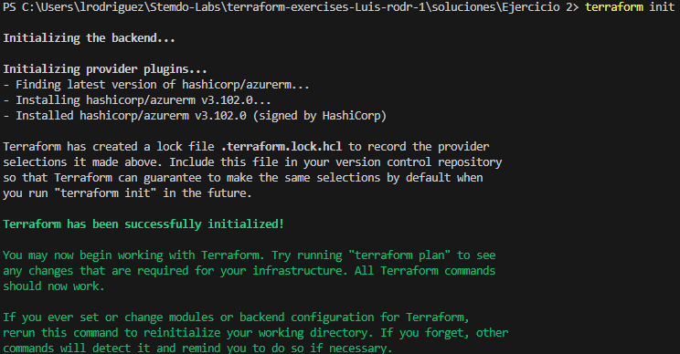
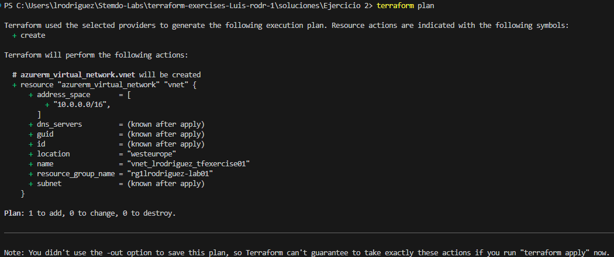
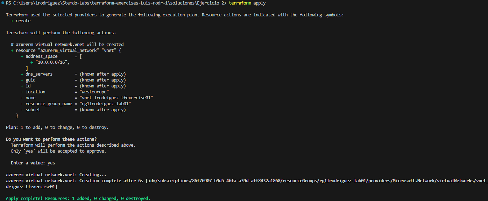

## Ejercicio 2
### Valores predeterminados

 - Situándonos en la ruta de este fichero, o, según este repo, "./solucines/Ejercicio 2", ejecuta los siguientes comandos para crear el recurso con valores predeterminados.
    
    Puedes asignar valores a las tres variables para este ejercicio de las dos siguientes maneras.

    -  Fichero terraform.tfvars

    Paso 1:
    ``` bash
    terraform init
    ```
    La salida será de la forma: 
    
    
    Paso 2:
    ``` bash
    terraform plan
    ```
    

    Paso 3:
    ``` bash
    terraform apply
    ```
    

    Recuerda dar el input "yes" (sin las comillas) cuando ```terraform apply``` te pida un input

    Con eso se habra creado el recurso con los valores predeterminados.

    E


    ```
    ```